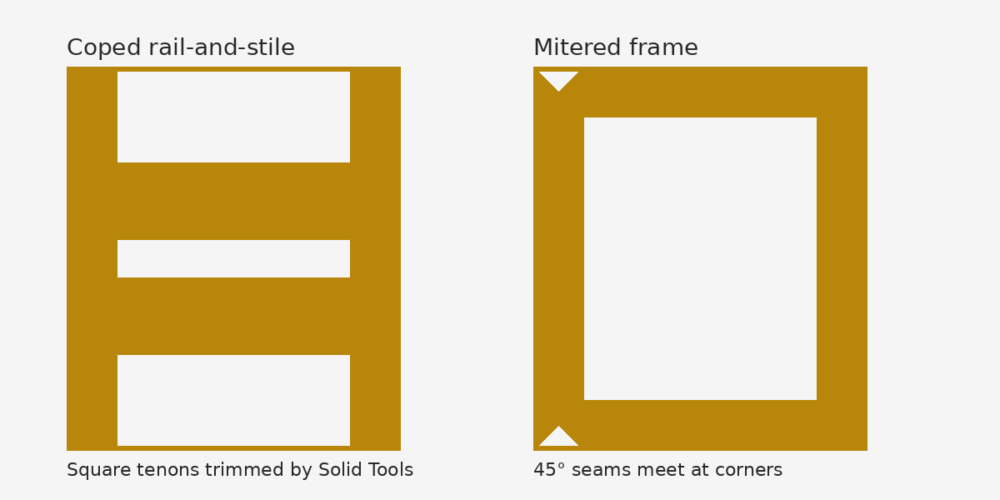
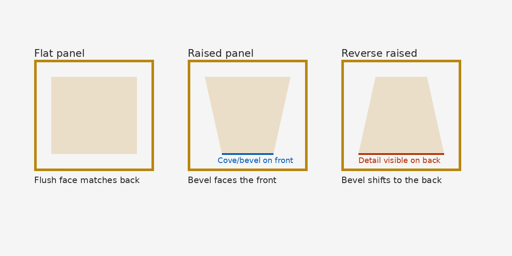
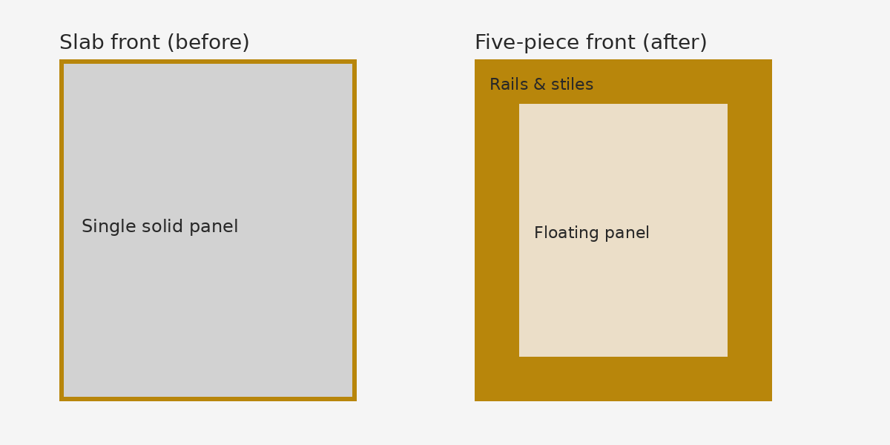
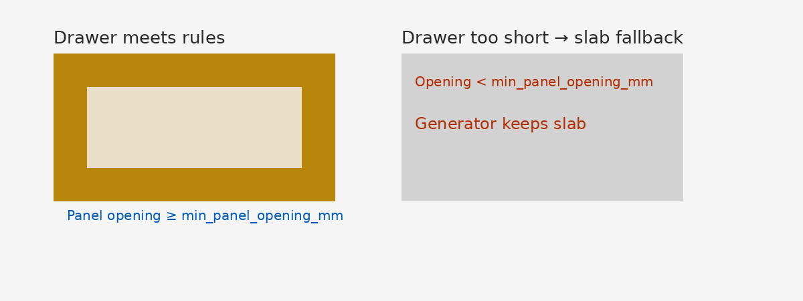

# Five-piece doors

## Overview

Five-piece doors replace a single slab with a frame made from two vertical **stiles**, two horizontal **rails**, and a floating **panel**. The frame sets the finished width and height while the panel "floats" inside a groove so seasonal movement does not twist the door. The Fronts dialog applies the same terminology you will see in code and metadata (`stile_width_mm`, `rail_width_mm`, etc.), making it easy to correlate UI changes with stored parameters.

## Quick start

1. Select a single AI Cabinets front component in SketchUp.
2. Run **Extensions → AI Cabinets → Fronts…** (or the toolbar button) to open the Fronts dialog.
3. Pick a **Door style**:
   - **Slab** keeps the original one-piece panel.
   - **Five-piece — cope & stick** builds a traditional rail-and-stile frame.
   - **Five-piece — miter** creates 45° joints at every corner.
4. Enter frame dimensions with any units supported by SketchUp. The dialog parses metric and imperial strings, so `57 mm`, `2 1/4"`, and `1'-10 1/4"` all work. Values are converted to millimeters and stored with `_mm` suffixes to match project invariants.
5. Choose whether the edit applies to **This instance only** (makes the component unique) or to the shared **Component Definition**.
6. Click **Apply** to regenerate the front, or **Reset to defaults** to reload the shipped five-piece defaults.

The dialog also exposes drawer-specific guardrails under **Advanced ▸ Drawer rules**, and the banner at the bottom surfaces validation errors returned by `AICabinets::Params::FivePiece`.

## Joint types

The left half shows a traditional **coped rail-and-stile** frame: rails are cut square, then their tenons are trimmed with SketchUp’s Solid Tools so they nest into the stiles. The right half shows a **mitered** frame where all four members meet at 45° seams. When SketchUp reports that boolean operations are unavailable (for example SketchUp Make or SketchUp Free), AI Cabinets still builds the cope-and-stick frame but leaves the rail ends square and posts a warning so you know the rails intersect instead of subtracting cleanly.

## Panel styles

*Flat* panels leave both faces flush. *Raised* panels route the cove/bevel on the front, while *Reverse raised* flips that detail toward the back so the cabinet interior shows the profile. A simple Shaker profile ships today; additional inside profiles can be added later because the dialog already stores the `inside_profile_id`.

## Before/after – slab vs five-piece

Use this comparison when previewing the effect of enabling five-piece fronts for an existing cabinet row. The five-piece version thickens the silhouette with rails and stiles while keeping the same outside dimensions.

## Defaults & validation

The front dialog delegates to `AICabinets::Params::FivePiece`, so every value you enter is coerced to millimeters, clamped where necessary, and stored on the component definition (`five_piece:*` keys inside the `AICabinets` dictionary).

| Parameter | Default or fallback | Notes |
| --- | --- | --- |
| `stile_width_mm` | 57 mm | Must be wide enough for the joint type: at least 50 mm for cope-and-stick, 55 mm for miter, and never less than `(groove_depth_mm * 2) + 12`. |
| `rail_width_mm` | Matches stile width when blank | Rails may not be narrower than half the stile width. |
| `drawer_rail_width_mm` | `nil` (uses rail width) | Drawer requests below `min_drawer_rail_width_mm` are clamped and may trigger a slab fallback when the opening gets too small. |
| `panel_thickness_mm` | 9.5 mm | Must exceed `panel_clearance_per_side_mm` and still fit inside the groove depth (0.5 mm seating clearance is enforced). |
| `panel_clearance_per_side_mm` | 3 mm | Valid range is 0–6 mm so the panel can float without rattling. |
| `groove_depth_mm` | 11 mm | Must be greater than the panel thickness so the panel can seat without protruding. |
| `groove_width_mm` | Auto | Optional override that must be at least `panel_thickness_mm + (panel_clearance_per_side_mm * 2)`. |
| `panel_cove_radius_mm` | 12 mm | Drives the cove on raised/reverse-raised panels. |
| `door_thickness_mm` | 19 mm | Sets the frame thickness for rails and stiles. |
| `min_drawer_rail_width_mm` | 38 mm | Drawer rails are clamped to this minimum when you request something thinner. |
| `min_panel_opening_mm` | 60 mm | Drawer openings shorter than this regenerate as slab fronts. |
| `panel_grain` | Vertical | Front faces inherit vertical grain on stiles and horizontal grain on rails by default; panel grain can switch to horizontal for special runs. |

Additional rules enforced by the params and geometry layers:

- All serialized values end in `_mm` and remain in millimeters until converted to SketchUp `Length` objects at modeling time.
- `panel_thickness_mm` must be thicker than the clearance per side or the validator reports an error.
- Panels fit only when both the adjusted width and height remain positive after subtracting clearances on every edge.

## Materials & grain

`AICabinets::Appearance.apply_five_piece_materials!` applies the frame material to the stiles and rails and the panel material to the floating panel. Both materials default to solid colors (`Maple` for frames, `MDF` for panels) so color-only swatches render correctly even when no textures are present. Front faces on stiles always orient the texture vertically, rails rotate to horizontal, and the center panel honors the `panel_grain` dropdown from the dialog.

## Metadata & tags

Five-piece parts live on the `AICabinets/Fronts` tag, use stable names (`Door-Stile-L`, `Door-Stile-R`, `Door-Rail-Top`, `Door-Rail-Bottom`, `Door-Panel`), and carry metadata describing the joint and panel style. `AICabinets::BOM.parts_for` reads those tags to build a high-level bill of materials, so leaving the tag and names intact keeps downstream exports stable.

## Fallbacks & limitations

- **Solid Tools availability** – The cope-and-stick workflow subtracts rail tenons from the stiles only when SketchUp exposes `Group#subtract`. SketchUp Pro ships those Solid Tools; SketchUp Make and SketchUp Free do not. When booleans are missing the generator posts a warning and leaves square intersections so you can manually clean up the joints later.
- **Drawer short-front rules** – `AICabinets::Rules::FivePiece.evaluate_drawer_front` measures the outside drawer height and compares it to `min_panel_opening_mm`. If the panel opening would be shorter than that minimum, the drawer quietly regenerates as a slab front. The dialog banner will mention the slab fallback the next time you open the front.
- **Square/intersect fallback** – When Solid Tools are missing, rails and stiles overlap rather than cut each other. Expect a square outline at the interior corners until you run SketchUp Pro’s boolean tools.
- **Why did my front turn into a slab?**
  - The drawer opening is shorter than `min_panel_opening_mm` after subtracting the rails, so the rule engine chose `action: :slab`.
  - The dialog was set to **Slab** when you clicked Apply.
  - Validation failed and the frame was never rebuilt—check the banner for messages about rail or panel dimensions.

## Version & edition notes

This branch targets SketchUp 2026, matching the deployment and TestUp tooling documented in the README. SketchUp Pro is recommended because it includes the Solid Tools package that AI Cabinets relies on for the cope-and-stick boolean trims. SketchUp Make/Free can still open the dialog and generate five-piece fronts, but the rails remain square where they meet the stiles.

## FAQ / Troubleshooting

- **“stile_width_mm … is too small”** – Increase the stile width or reduce the groove depth so `(groove_depth_mm * 2) + 12` stays below the stile width. The validator blocks frame sizes that cannot contain the requested joinery.
- **“panel_thickness_mm must exceed panel_clearance_per_side_mm”** – Lower the clearance or use a thicker panel so the groove still captures the panel tongue.
- **“Panel thickness … exceeds groove depth”** – Increase `groove_depth_mm` or use a thinner panel; at least 0.5 mm of headroom is required for the panel to seat.
- **“panel_thickness_mm … requires groove_width_mm at least …”** – When you explicitly set `groove_width_mm`, make sure it equals the panel thickness plus the clearances on both sides. Leave the field blank to let the generator size the groove automatically.
- **Unit entry quirks** – If the dialog shows a validation error but you typed an imperial fraction, click **Reset to defaults**, re-enter the value with explicit units (for example `2 1/4"` or `1'-10 1/4"`), and click **Apply** again. The dialog also offers a **Reset to defaults** button to reload the shipped millimeter values before retrying.
- **Front not selected** – The dialog only reads or writes five-piece data when exactly one AI Cabinets front component is selected. If you see “Select a single AI Cabinets front component to edit,” close the dialog, select the desired door, and reopen.
