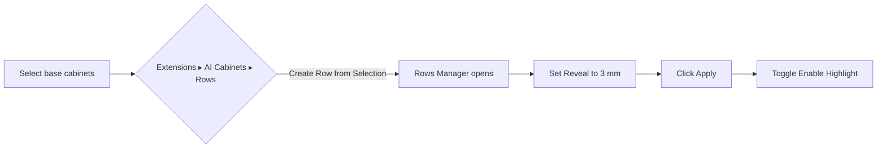
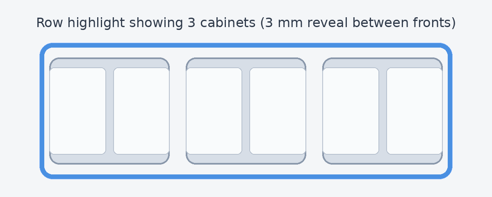

# Using Rows

AI Cabinets rows keep a line of base cabinets aligned, let you coordinate width edits, and apply consistent reveals across matching fronts. This guide covers how to create and manage rows, how reflow reacts to different edit scopes, how to use `row_reveal_mm` for uniform gaps, and what happens when **Lock total length** is enabled.

## Terminology

- **Row** – An ordered set of AI Cabinets base cabinets that share a front-left-bottom (FLB) origin axis and reflow together.
- **`row_id`** – Stable identifier assigned when a row is created. Displayed in **Rows Manager ▸ Row ID**.
- **`row_pos`** – 1-based index for each member within a row. Shown in the Members list and used when reordering.
- **`row_reveal_mm`** – Row-level edge reveal (in millimeters) applied when you press **Apply** in the Rows Manager.
- **Lock total length** – Row attribute that keeps the summed width constant during reflow by letting the rightmost filler absorb deltas.
- **Filler** – The last member in the row that is eligible to shrink or grow when lock is active. It must stay at least 25&nbsp;mm wide.

## Quickstart (≈1 minute)

1. Insert or select at least three base cabinets that are roughly collinear along world X.
2. Run **Extensions ▸ AI Cabinets ▸ Rows ▸ Create Row from Selection**.
3. In the **Rows Manager** dialog, the new row is selected. Set **Reveal** to `3` and click **Apply** to store `row_reveal_mm = 3`.
4. Click **Enable Highlight** to toggle the overlay and confirm the row span.

## Manage row members

Use the **Rows Manager** (Extensions ▸ AI Cabinets ▸ Rows ▸ **Manage Rows…**) to keep members in sync.

### Add or remove cabinets

- **Add Selection** – Select one or more AI Cabinets cabinets that are collinear with the row, then click **Add Selection**. The dialog calls `rows.add_members` and the new members inherit sequential `row_pos` values.
- **Remove Selection** – Select one or more members in SketchUp (or highlight them in the Members list) and click **Remove Selection**. The command invokes `rows.remove_members` and compacts `row_pos` indices.
- Rows only accept unlocked AI Cabinets base cabinets. Mixed definitions, rotated instances, or gaps larger than 0.5&nbsp;mm along X cause creation to fail with a warning.

### Reorder

- Click a member in the list to select it, then use **Move Up** or **Move Down**. The UI sends the updated persistent IDs to `rows.reorder`, which swaps `row_pos` values.
- Rows remain FLB anchored; reordering does not translate cabinets automatically. If you need a different physical order, move the cabinets in SketchUp first and then reorder to match.

### Highlight and auto-select

- **Enable Highlight / Disable Highlight** calls `rows.highlight` so that the entire row receives the outline shown above.
- The **Rows: Toggle Highlight** toolbar button provides the same toggle outside the dialog.
- Turn on **Auto-select row on member select** to let the `Rows: Auto-select Row on Member Select` command expand your SketchUp selection to the entire row whenever you pick a member. Disable it if you only want single cabinets selected.

## Width edits and reflow

Editing a member’s width uses `AICabinets::Rows::Reflow.apply_width_change!`. The origin stays locked to the first member’s FLB; right-side neighbors translate by the cumulative width increase of preceding edited members.

- **This instance only** (`scope: :instance_only`) widens or narrows just the edited cabinet. Only members to its right move, and they shift by the single Δw.
- **All instances** (`scope: :all_instances`) rebuilds the shared definition. Every occurrence in the row grows by the same Δw, so the cumulative translation equals Δw times the number of downstream occurrences.
- Reflow skips members left of the edited cabinet. Right neighbors translate in world X only; Y/Z coordinates remain untouched.
- If **Lock total length** is off, the row’s overall length changes by the total delta returned by reflow.

### Lock total length and fillers

When **Lock total length** is checked, `Rows::Reflow` asks the rightmost member to absorb the difference.

- The filler (last member) shrinks or grows by the total Δw to keep the row’s combined width unchanged.
- Filler width may not drop below 25&nbsp;mm. If the requested change exceeds that capacity, `row.lock_total_length` raises `:lock_length_failed` and nothing changes. Reduce the width adjustment, unlock the row, or reposition a larger filler to succeed.
- Lock applies to both instance-only and all-instances edits. The filler update always runs instance-only so that existing definitions stay intact.

## Uniform reveals with `row_reveal_mm`

Row reveal unifies overlay door gaps by splitting shared boundaries while keeping exposed ends full width.

- Set **Reveal** in the Rows Manager, then click **Apply**. Values use model units, but entries are stored in millimeters.
- Interior neighbors that opt into row reveal divide the configured gap: a 3&nbsp;mm reveal trims each door 1.5&nbsp;mm at the shared boundary.
- Exposed ends keep the full reveal, so the outermost door edge sits 3&nbsp;mm back from the carcass.
- Members with **Use row reveal** disabled (legacy or manual overrides) keep their original reveals. Re-enable the row reveal toggle per cabinet to opt back in.
- The reveal generator covers frameless overlay and face-frame overlay doors through `Generator::Fronts`.

### Applying reveals again

- Edit the reveal value whenever needed and press **Apply** to re-run `Rows::Reveal.apply!`. The operation makes definitions unique before trimming, so existing component definitions are not shared across rows afterward.
- To revert to cabinet-level reveals, enter the original door edge values in the Edit Cabinet dialog or disable row reveal on the cabinet instance.

## Troubleshooting

- **Selection must be collinear** – If creation fails with `:not_collinear`, nudge cabinets until their FLB origins align within 0.5&nbsp;mm along world X.
- **Mixed definitions** – Each member must be an AI Cabinets base cabinet. Verify via **Extensions ▸ AI Cabinets ▸ Rows ▸ Manage Rows… ▸ Add Selection**; other components will be rejected.
- **Locked or grouped cabinets** – Unlock cabinets and explode wrapping groups before creating a row.
- **Rotated rows** – Rows assume world-X alignment. Rotated runs are out of scope; use cabinet move tools instead.
- **Lock failures** – When a locked row cannot absorb a width change, the manager keeps the previous widths. Adjust the filler or uncheck **Lock total length** before retrying.

## Reference

- **Commands** (Extensions ▸ AI Cabinets ▸ Rows)
  - Create Row from Selection
  - Manage Rows…
  - Rows: Add Selection
  - Rows: Remove from Row
  - Rows: Toggle Highlight
  - Rows: Auto-select Row on Member Select
- **Rows Manager shortcuts**
  - Press **Tab** to jump between list and detail panes.
  - Use **Enter** to apply a reveal value after typing.
  - Up/Down arrow keys move the selection in the Members list before clicking **Move Up/Move Down**.
- **Persistent data**
  - Row metadata lives under the model dictionary `AICabinets.Rows`.
  - Member instances store `row_id` and `row_pos` in the `AICabinets.Row` dictionary.

## Changelog

- Added in v0.1.0 — initial publication of the Rows user guide, visuals, and workflow overview.
