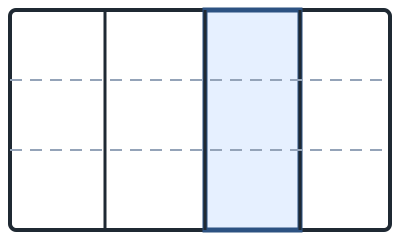
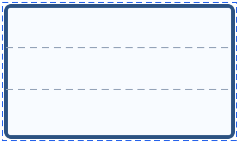

# Dialog Layout Preview — UX Specification

## Summary

This document defines the UX contract for the configuration dialog's line-art front preview. It describes layout rules, interaction states, accessibility requirements, and click-map behavior for selecting cabinet bays. The specification is paired with a lightweight HTML prototype (`aicabinets/ui/prototypes/layout_preview/index.html`) that demonstrates the behaviors described here.

## Goals & Scope

- Provide a scaled front view that respects cabinet proportions, bay separators, and front group hints.
- Clearly communicate the active bay through accessible visual treatments.
- Allow pointing-device and keyboard users to select bays directly within the preview.
- Remain HtmlDialog-friendly (BP-1) and avoid prescribing persistence changes.

Out of scope: cabinet geometry generation, storage changes, or the final HtmlDialog integration.

## Preview Layout

### Pane Placement & Padding

- The preview occupies the right column of the dialog above the action buttons. Reserve 16&nbsp;px outer padding inside the dialog sheet.
- Minimum preview size: **240&nbsp;px × 180&nbsp;px**. Maximum width: **480&nbsp;px** (height scales by aspect ratio). The preview expands responsively but never shrinks below the minimum to preserve hit targets.
- The preview canvas adds letterbox padding when the available aspect ratio differs from the cabinet ratio. Letterbox padding uses the dialog background color (#f8fafc) so vertical or horizontal bars blend with the sheet.
- Maintain a 12&nbsp;px gap between the preview and neighboring panels to avoid crowding.

### Aspect-Fit Policy

- Compute the cabinet's front aspect ratio as `width_mm / height_mm`. Use the preview's padding-adjusted dimensions to scale proportionally.
- The cabinet drawing is centered within the padded viewport. If the cabinet is taller than the viewport, scale by height and letterbox horizontally; if wider, scale by width and letterbox vertically.
- Outer frame stroke weight is proportional to the scaled cabinet width: `max(2px, round(0.008 * scaled_width))`. Partition lines use `0.6 × outer stroke`. Front group hints use dashed lines at `0.4 × outer stroke`.
- Bay separators originate from normalized bay edges (see [Click Map](#click-map)). Dividers align with the scaled cabinet bounds even when the letterbox padding is present.

### Figures

These figures illustrate the whole-cabinet default view and the single-bay focus treatment, respectively.

## Visual Language & States

| State | Treatment |
| --- | --- |
| Default | Outer frame stroke `--preview-stroke` (#1f2933); partition stroke `--preview-divider` (#1f2933 at 60% opacity); front-group hints dashed (#94a3b8, dashed 12&nbsp;px / 8&nbsp;px). Fill remains transparent. |
| Hover (pointer) | Overlay fill `RGBA(59, 130, 246, 0.08)` clipped to the hovered bay. Cursor becomes `pointer`. |
| Focus (keyboard) | Add a 2&nbsp;px inset focus ring (`#2563eb`, dashed 10&nbsp;px / 6&nbsp;px) around the focused bay's overlay rectangle. Focus ring is always visible while the preview owns focus. |
| Active (selected) | Increase bay border stroke to `--preview-active-stroke` (#2c5282) at `1.3 × outer stroke` and add a subtle fill `RGBA(59, 130, 246, 0.15)`. Ensure contrast ratio ≥ 4.5:1 against white. |
| Disabled | (Reserved) Reduce opacity to 50% when the preview is disabled by the hosting form. |

Stroke scaling ensures line weights remain legible across dialog sizes. When the scaled width drops below 320&nbsp;px, clamp the active stroke to 3&nbsp;px to avoid overpowering adjacent bays.

## Interaction Contract

### Pointer

- Clicking anywhere inside a bay's overlay selects that bay and synchronizes with the form's bay selector field.
- Hover feedback appears after 120&nbsp;ms dwell to avoid flicker. Hovering a bay updates the tooltip text.

### Keyboard

- The preview container behaves as a single tabbable control. Pressing `Tab` moves focus into the preview; focus lands on the active bay if present, otherwise the first bay.
- `ArrowLeft` / `ArrowRight`: move selection to the adjacent bay (wrap disabled).
- `Home` / `End`: jump to the first / last bay.
- `Enter` or `Space`: commit the focused bay as the active selection and emit the same change event as a mouse click.
- `Escape`: returns focus to the hosting form but does not change selection (HtmlDialog default behavior).

### Tooltips

- Each bay exposes `title="Bay N – <Position>"`, e.g., "Bay 2 – Center Left". Positions follow left-to-right order: Left, Center Left, Center Right, Right. For ≥5 bays, use numeric labels after Left/Right (e.g., "Bay 3 – Middle").

### Feedback Synchronization

- When another control changes the active bay, the preview updates selection, focus ring, and tooltip immediately.
- The preview emits a `baychange` custom event (`detail: { index, id }`) for integration with HtmlDialog bridge code. The prototype demonstrates the event payload.

## Accessibility

- Preview container role: `listbox`. Each bay overlay is an `option` element with `aria-selected="true"` on the active bay.
- Use `aria-label="Cabinet bay preview"` on the listbox. Each option gets `aria-label="Bay N, <Position>, width <fraction>% of cabinet"`.
- Maintain DOM order left-to-right to align with arrow key expectations.
- Focus indicator meets WCAG 2.1 1.4.11 by using a 3:1 contrast ring against both the bay fill and surrounding canvas.
- The tooltip text is duplicated via `aria-description` so screen readers announce the same content without relying on hover.
- Do not trap focus: Shift+Tab exits to the prior control, and Tab moves to the next control per dialog order.

## Click Map

- Input model: `bays: [ { id: "BAY_L", fraction: 0.33 }, … ]`, where `fraction` is each bay's normalized width (sum = 1.0). Fractions derive from cabinet parameters but are not persisted here.
- Compute cumulative edges as `[0, f1, f1+f2, …, 1]`. Multiply by the scaled cabinet width to obtain geometric dividers.
- Clickable overlays expand each bay to a **minimum visual width of 44&nbsp;px** regardless of the fraction. When a bay's computed width is narrower, extend the overlay equally on both sides but keep dividers visible via an inner inset border.
- Overlays always cover the full cabinet height (minus outer stroke inset) to satisfy Fitts' Law in vertical dimension.
- Z-order: overlays sit above lines, but pointer events are clipped to each overlay's bounding box so clicks do not bleed into neighbors.
- Event hit test: pointer events fire on the overlay; keyboard selection manipulates the same array of overlays.

### Edge Cases

- **Single bay**: overlay spans the entire canvas. Focus ring matches the outer frame (see figure above).
- **Many bays (≥6)**: enforce the 44&nbsp;px minimum overlay width. When geometry is narrower, display a subtle gradient hint across the overlay to telegraph compression while maintaining clickable space.
- **Extremely narrow fractions (<0.08)**: keep the divider at the true normalized position but allow the overlay to extend past it; the active border aligns with the divider to communicate actual width.

## Prototype Reference (Option A)

Open `aicabinets/ui/prototypes/layout_preview/index.html` in a browser or HtmlDialog. The prototype showcases:

- Two sample configurations (1-bay and 4-bay) selectable from a dropdown.
- Mouse click, keyboard navigation, focus ring, and tooltip text consistent with this specification.
- Console logs of the `baychange` event payload for integration testing.

## Rationale

- `listbox`/`option` roles align with BP-1 HtmlDialog guidance and match the discrete selection model.
- 44&nbsp;px minimum targets align with WCAG 2.5.5 (Target Size) recommendations while leaving space for narrow dividers.
- Dash patterns visualize front group hints without competing with active highlights.
- Stroke scaling prevents thick outlines from dominating on small previews while preserving clarity on large dialogs.
