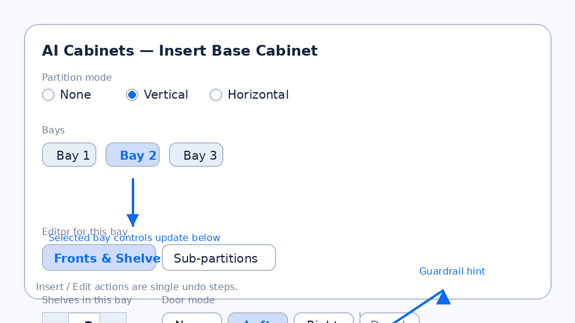
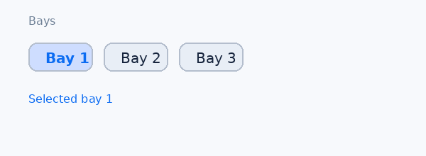

# AI Cabinets user guide

## Per-bay shelves & doors

The Insert / Edit dialog lets you configure every bay independently so doors and shelves match the opening. Use the quick start to see the workflow, then dive into the reference sections for bay selection, editor modes, scope, and guardrails.

### Quick start: three vertical bays with mixed fronts

1. Set **Partition mode** to **Vertical** and enter a count of **2**. The dialog creates three bay chips (count + 1) and auto-selects **Bay 1**.【F:aicabinets/aicabinets/ui/dialogs/insert_base_cabinet.js†L2942-L2980】
2. Stay in **Fronts & Shelves**. Give **Bay 1** two shelves and leave **Door mode** on **None** for an open cubby.【F:aicabinets/aicabinets/ui/dialogs/insert_base_cabinet.js†L3035-L3079】
3. Click the **Bay 2** chip. Set shelves to one and choose **Door mode → Left**.【F:aicabinets/aicabinets/ui/dialogs/insert_base_cabinet.js†L1456-L1499】【F:aicabinets/aicabinets/ui/strings/en.js†L9-L27】
4. Click **Bay 3**. Set shelves to zero and pick **Door mode → Double**. If the bay is narrower than twice the minimum leaf width, the control disables and shows a hint (see guardrails below).【F:aicabinets/aicabinets/ui/strings/en.js†L23-L35】【F:aicabinets/aicabinets/ui/dialogs/insert_base_cabinet.js†L3035-L3079】
5. Choose **Insert** to drop the cabinet. Later, select it in SketchUp and click **Edit Base Cabinet… → This instance only** to adjust just one bay without affecting copies.【F:aicabinets/aicabinets/ui/dialogs/insert_base_cabinet.html†L36-L87】【F:aicabinets/aicabinets/ops/edit_base_cabinet.rb†L60-L116】

### Selecting bays

- The **Bays** chip strip always matches the number of leaf bays (`count + 1` for even partitions, or partition positions + 1). Chips grow or shrink automatically when you change **Partition mode** or **count**.【F:aicabinets/aicabinets/ui/dialogs/insert_base_cabinet.js†L2961-L3004】
- When bays are removed (for example, lowering the partition count), the selected chip clamps to the last remaining bay so you never end up with an invalid index.【F:aicabinets/aicabinets/ui/dialogs/insert_base_cabinet.js†L2971-L2999】【F:aicabinets/aicabinets/ui/dialogs/insert_base_cabinet.js†L1456-L1499】
- Clicking a chip or using the arrow keys updates the **Fronts & Shelves** panel for that bay immediately. Focus and announcements follow the active chip for accessibility.【F:aicabinets/aicabinets/ui/dialogs/insert_base_cabinet.js†L1456-L1499】【F:aicabinets/aicabinets/ui/strings/en.js†L9-L37】

### Editing shelves and doors per bay

- The **Fronts & Shelves** editor exposes two controls per bay:
  - **Shelves in this bay** uses `–` and `+` steppers and stores the value in `fronts_shelves_state.shelf_count`, so the number round-trips when you revisit the bay.【F:aicabinets/aicabinets/ui/dialogs/insert_base_cabinet.js†L3035-L3066】
  - **Door mode** offers **None**, **Left**, **Right**, and **Double**. The selected value is stored in both `door_mode` and `fronts_shelves_state.door_mode` so it persists across dialog sessions.【F:aicabinets/aicabinets/ui/dialogs/insert_base_cabinet.js†L3066-L3079】【F:aicabinets/aicabinets/ui/strings/en.js†L23-L31】
- Buttons such as **Apply to all** or **Copy L→R** (when enabled) respect door guardrails and skip bays that would break the leaf-width minimum, posting a status message instead of failing.【F:aicabinets/aicabinets/ui/strings/en.js†L31-L44】
- Only leaf bays (ones without sub-partitions) receive shelves and doors. Parent bays switch to **Sub-partitions**, and the generator skips fronts so nested bays can define their own counts and modes.【F:aicabinets/README.md†L96-L116】

### Switching between Fronts & Shelves and Sub-partitions

- The bay editor toggle offers **Fronts & Shelves** and **Sub-partitions**. Switching modes hides one panel and activates the other without losing data.【F:aicabinets/aicabinets/ui/dialogs/insert_base_cabinet.js†L1759-L1764】
- Shelf and door values stay in `fronts_shelves_state` even while **Sub-partitions** is active, so returning to **Fronts & Shelves** restores the previous counts and door mode for that bay.【F:aicabinets/aicabinets/ui/dialogs/insert_base_cabinet.js†L3035-L3080】【F:aicabinets/aicabinets/ui/dialogs/insert_base_cabinet.js†L4503-L4524】
- Sub-partitions track their own `subpartitions_state.count` field, and the sanitizer keeps orientations perpendicular so nested bays remain valid.【F:aicabinets/aicabinets/ui/dialogs/insert_base_cabinet.js†L4513-L4523】【F:aicabinets/README.md†L96-L116】

### Insert vs Edit scope

- **Insert** creates a new component definition and instance in one SketchUp undo step. The extension wraps the operation with `start_operation` / `commit_operation`, so one `Ctrl+Z` removes the entire insert.【F:aicabinets/aicabinets/ops/insert_base_cabinet.rb†L66-L117】
- **Edit Base Cabinet…** opens the same dialog in edit mode. You choose a scope before saving:
  - **This instance only** calls `make_unique` so changes apply to the selected cabinet without affecting other copies.【F:aicabinets/aicabinets/ui/dialogs/insert_base_cabinet.html†L36-L87】【F:aicabinets/aicabinets/ops/edit_base_cabinet.rb†L60-L220】
  - **All instances** edits the shared definition so every placed copy updates together.【F:aicabinets/aicabinets/ops/edit_base_cabinet.rb†L160-L220】
- Saving an edit also runs inside a single SketchUp operation, so undo reverts the entire change regardless of scope.【F:aicabinets/aicabinets/ops/edit_base_cabinet.rb†L60-L116】

### Guardrails for narrow bays

- Double doors require each leaf to be at least `constraints.min_door_leaf_width_mm` wide (140 mm by default). When a bay is too narrow, the **Double** segment disables and shows the hint “Double doors disabled: minimum leaf width 140 mm.”【F:aicabinets/aicabinets/data/defaults.json†L1-L24】【F:aicabinets/aicabinets/ui/strings/en.js†L23-L35】
- The guardrail runs client-side and server-side. If a legacy model forces **Double** on a too-narrow bay, the generator logs a skip and omits the invalid doors instead of failing.【F:aicabinets/aicabinets/generator/fronts.rb†L268-L305】
- Status banners announce when bulk actions skip bays that cannot host double doors, so you know which bays need wider openings.【F:aicabinets/aicabinets/ui/strings/en.js†L31-L44】

### Troubleshooting doors

- **Double is disabled**: widen the bay or reduce reveals until each leaf exceeds 140 mm. The hint lists the measured leaf width versus the minimum.【F:aicabinets/aicabinets/ui/strings/en.js†L23-L35】
- **Legacy file lost double doors**: rebuild fronts with wider bays; the generator intentionally skips impossible double leaves to avoid broken geometry.【F:aicabinets/aicabinets/generator/fronts.rb†L268-L305】

### Reference reminders

- Dimensions are stored in millimeters (mm). Adjustments in the dialog honor the SketchUp model units, but serialized defaults use mm throughout.【F:aicabinets/README.md†L64-L93】【F:aicabinets/aicabinets/data/defaults.json†L1-L24】
- Cabinets insert from the **front-left-bottom (FLB)** corner. Partition layouts and bay edits never move that anchor point.【F:aicabinets/README.md†L14-L42】
- Only leaf bays accept shelves and doors; bays with sub-partitions act as containers for nested leaves.【F:aicabinets/README.md†L96-L116】
